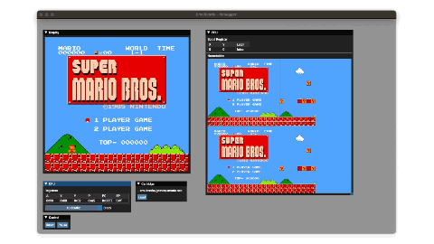

# Emultendo - NES emulator

Emultendo is yet another NES emulator. Written in Rust.

It's implementation is far from finished (no sound, only games with mapper 0 supported, partial implementation of the PPU).

## Project structure

The project is composed of 3 crates:

- **emultendo-core**: the actual implementation of the emulator, with almost no external dependency
- **emultendo-standalone**: an SDL2 GUI for the emulator
- **emultendo-debugger**: a debugger application made with imgui

## Running the emulator

From the project root:

```bash
$ cd standalone
$ cargo run --release
```

Once launched, a black window appears: just drag and drop a`.nes` catridge file to start a game.

### Controls

<kbd>⬆</kbd> Up
<kbd>⬇</kbd> Down
<kbd>⬅</kbd> Left
<kbd>➡</kbd> Right
<kbd>A</kbd> A
<kbd>S</kbd> B
<kbd>Space</kbd> Select
<kbd>Return</kbd> Start

## Running the debugger

From the project root:

```bash
$ cd debugger
$ cargo run --release
```

Once launched use the GUI to load a cartridge file.

<center>

</center>